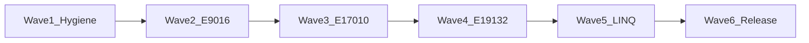

# Design: Full Functional release acceptance remediation

**Date:** 2026-07-24  
**Task:** `.trellis/tasks/07-24-full-functional-remediation`  
**Evidence:** `E:\Work\Tests\entityframeworkcore-xugu-release-test\TEST-REPORT.md` (2026-07-24)  
**Status:** Approved (path 1 / six-wave single task)

## 1. Goal

Bring Windows dual-mode Functional to **0 FAIL** under Done definition A (authoritative Skips for Xugu hard limits only). Keep package **9.0.0**. Intermediate work: **local commits only, no push**. Final gate: independent suite PASS → **first push** → overwrite GitHub `v9.0.0`.

## 2. Locked decisions

| Topic | Choice |
|-------|--------|
| Done | 0 FAIL + authoritative Skip (APPLY/LATERAL; doc-confirmed E17010, etc.) |
| Version | Overwrite `v9.0.0` / 9.0.0 at end only |
| Wave order | Hygiene → E9016 → E17010 → E19132 → LINQ/semantics → full suite + overwrite |
| Intermediate remote | No push; no mid-wave Release overwrite |
| Out of hard gate | Linux prod verification; Functional discovery/count infra (8412 vs 5977 / duplicate IDs) |

## 3. Architecture

Single Trellis task; six sequential waves. Each wave has its own filter gate and local commit. Dialect authority remains Xugu official docs; no `external/` edits; user-facing errors via `XuguStrings.resx`.

### Wave 1 — Hygiene

- Finish remaining APPLY/LATERAL Skip (~12 Many-to-Many shapes from revalidation).
- Unify native DLL packaging: stop embedding conflicting win-x64 `xugusql.dll` when packing with NuGet `Xuguclient` (prefer dependency assets only); document in USER-GUIDE / LIMITATIONS.
- Fix UTF-8 replacement characters in `docs/contracts/*.md`.

**Primary files:** Functional ManyToMany / related Query overrides; [`src/EFCore.Xugu/EFCore.Xugu.csproj`](../../../../src/EFCore.Xugu/EFCore.Xugu.csproj); contracts docs.

### Wave 2 — E9016 fixture isolation

- Root-cause shared store / table name collisions (`BlogsPart1` etc.).
- Strengthen prefix, Dispose, EnsureDeleted/recreate, or per-class store naming so isolation runs do not leave objects.

**Primary files:** `test/EFCore.Xugu.Tests.Shared/**`, Functional NonShared / BulkUpdates fixtures.

### Wave 3 — E17010

- Read Xugu `from.md` (and related) via docs map.
- Prefer rewriting SQL generation to avoid outer refs in FROM subqueries when dialect allows.
- Otherwise Skip + LIMITATIONS with doc anchors (no blind Skip).

**Primary files:** Query SQL generator / visitors; Functional overrides that fail E17010.

### Wave 4 — E19132

- Cluster failing SQL from isolated TRX/logs; fix generators (JOIN / DML / unexpected CROSS, etc.).
- Only Skip when official docs prove unsupported (already true for APPLY; possibly some UPDATE JOIN shapes already in LIMITATIONS).

**Primary files:** `XuguQuerySqlGenerator`, related translators, migration SQL if implicated.

### Wave 5 — LINQ + semantics + residuals

- Translation gaps, result/exception mismatches, SQL/string baselines, E5021, type materialization, “other”.
- Work by failure cluster using revalidation TRX classification; keep Unit/Integration green.

### Wave 6 — Close-out

- Run independent suite Functional native+compat (class-isolated as in revalidation).
- Upgrade `RELEASE-SCOPE` / `LIMITATIONS` / `CHANGELOG` from Wave A trialable → full capability (definition A).
- **First** `git push` of accumulated local commits; force-move tag + recreate GitHub Release `v9.0.0` (nupkg/snupkg). No nuget.org unless separately requested.

## 4. Verification strategy

| Gate | When |
|------|------|
| Unit Release 0 FAIL | Every wave |
| Integration 0 FAIL | Every wave that touches fixtures/connection/seed |
| Functional filter for wave cluster | End of each wave |
| Full Functional dual-mode 0 FAIL | Wave 6 only (independent suite) |
| Pack description + native policy | Wave 1 + Wave 6 |

## 5. Risks

| Risk | Mitigation |
|------|------------|
| Long-lived local-only history | Frequent local commits per wave; push only at Wave 6 |
| E17010/E19132 misclassified as “must fix” when dialect forbids | Doc-first; Skip with anchors |
| E9016 masks real bugs | Wave 2 before large translator work |
| Force-overwrite 9.0.0 surprises consumers | CHANGELOG + Release notes state full-capability overwrite |

## 6. Out of scope

- nuget.org; Linux prod cert; discovery/count infra epic; mid-wave remote push/tag overwrite.
